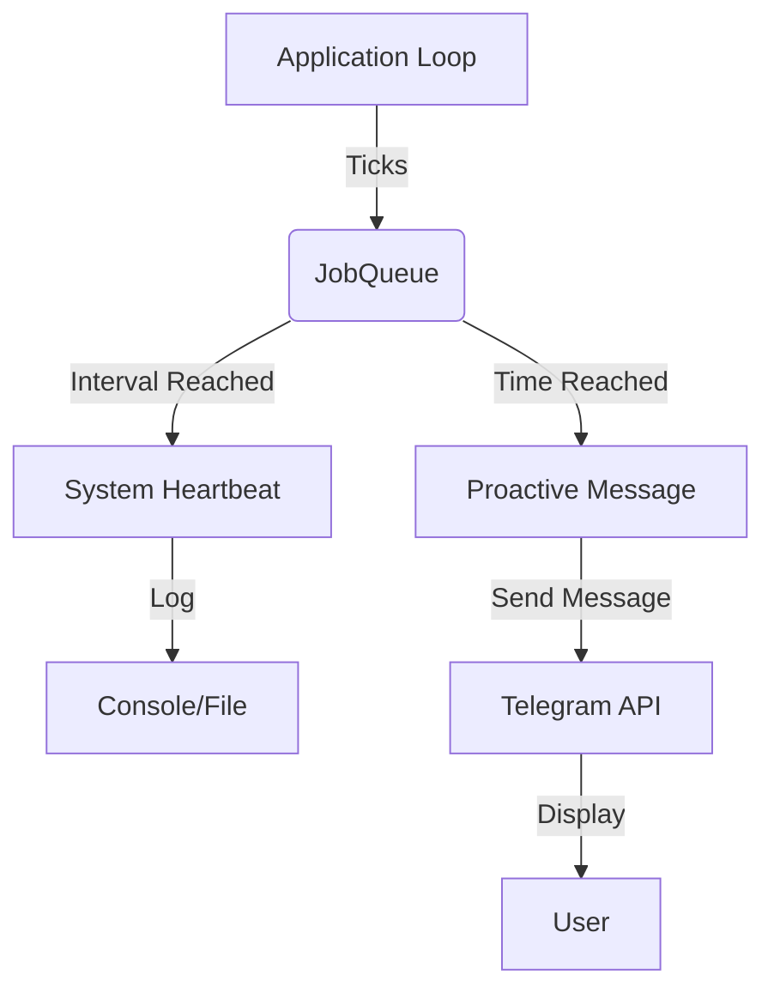

# Design: Heartbeat & JobQueue

## Architecture

We will use the `JobQueue` extension built into `python-telegram-bot` (PTB). This component integrates seamlessly with the `Application` class and the asyncio loop.

### Components

1.  **System Heartbeat Job (`system_heartbeat`)**
    - **Frequency**: Every 30 minutes (configurable).
    - **Action**: Log a heartbeat message with timestamp and basic memory usage (optional, strictly using native libs).
    - **Purpose**: Debugging and health monitoring without spamming the user.

2.  **Proactive Interaction Job (`proactive_ping` or `schedule_check`)**
    - **Frequency**: Configurable (e.g., Daily at 08:00 AM).
    - **Action**: Check if there's something relevant to say (initially just a "System Check" or "Bot Online" message to prove proactivity).
    - **Target**: `AUTHORIZED_USER_ID`.

### Data Flow

### Resource Considerations (Raspberry Pi)
- **Concurrency**: Jobs run as async coroutines. Blocking code in jobs will freeze the bot. We must ensure all job logic is strictly async or offloaded (not needed for simple text messages).
- **Persistence**: We will NOT implement job persistence (database checks) in this iteration to keep it "lite". If the bot restarts, the schedule resets (defined in code).

## Configuration
- Add `HEARTBEAT_INTERVAL` to `config.py` (default: 30 mins).

## Future Extensibility
This architecture is the foundational layer for future skills requested in the Roadmap:
- **Reminders ("me lembre às 10am")**: Will use `job_queue.run_once(callback, when=target_time, chat_id=user_id)`.
- **Morning Briefing ("previsão do tempo às 9am")**: Will use `job_queue.run_daily(callback, time=time(9,0), chat_id=user_id)`.
- **Scalability**: `python-telegram-bot`'s JobQueue is optimized for these exact scenarios, allowing hundreds of pending jobs with minimal overhead on the Raspberry Pi.
